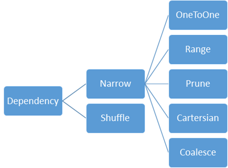

# How are RDDs converted to Job?
The actions of **RDD** will call `SparkContext.runJob`. After going through a series overloaded methods, it will call `SparkContext.dagScheduler.runJob`, which calls `DAGScheduler.submitJob`:
```scala
/**
   * Submit an action job to the scheduler.
   *
   * @param rdd target RDD to run tasks on
   * @param func a function to run on each partition of the RDD
   * @param partitions set of partitions to run on; some jobs may not want to compute on all
   *   partitions of the target RDD, e.g. for operations like first()
   * @param callSite where in the user program this job was called
   * @param resultHandler callback to pass each result to
   * @param properties scheduler properties to attach to this job, e.g. fair scheduler pool name
   *
   * @return a JobWaiter object that can be used to block until the job finishes executing
   *         or can be used to cancel the job.
   */
```
The `SparkContext.localproperties` will pass to the `properties` parameter.

Then, it comes to an important class **DAGScheduler**([ref](https://jaceklaskowski.gitbooks.io/mastering-apache-spark/spark-dagscheduler.html))

Job is submitted to `eventLoop: DAGSchedulerEventProcessLoop` in `submitJob()`:
```scala
eventProcessLoop.post(JobSubmitted(
      jobId, rdd, func2, partitions.toArray, callSite, waiter,
      SerializationUtils.clone(properties)))
```
All the events are handled by `DAGSchedulerEverProcessLoop.doOnReceive` in the eventLoop thread.
For the submitted job, it’s `DAGScheduler.handleJobSubmitted`.

Stages are created here by `getOrCreateParentStages`-> `getOrCreateShuffleMapStage`-> `createShuffleMapStage`. What to do inside a stage is not decided at this moment.

The stages are divided by **ShuffleDependency**, which is checked by `getShuffleDependencies` and `getMissingAncestorShuffleDependencies`(This one traverse the RDD tree). The dependency is defined in each RDD(`RDD. getDependencies`).



The final stage is **ResultStage**. All other intermediate stages are **ShuffleMapStage**s.
Each ShuffleDependency and Stage have a *unique* ID in the application. The ShuffledDependency ID is assigned by `SparkContext.newShuffleId`. The Stage ID is assigned by `DAGScheduler. nextStageId.getAndIncrement()`. 
The DAGScheduler maintains a global map `shuffleIdToMapStage` from ShuffleDependency to Stage, to avoid redundant stage creation.
