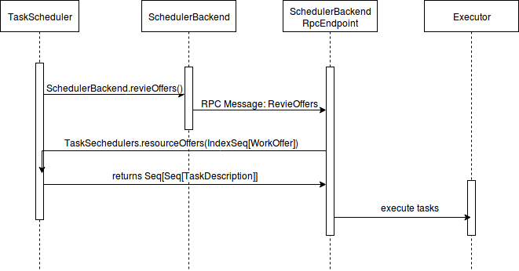

# How are tasks scheduled?
It starts from `DAGScheduler.submitMissingTasks`.

First, find all missing partitions of this stage. For final stage, the information is maintained in the ActiveJob; For shuffle stages, it’s maintained in the `mapOutputTrackerMaster`.

Then, `makeNewStageAttempt` will create a new StageInfo in the Stage.

Then, the RDD along with the dependencies are serialized with `clousureSerializer` and broadcast(It seems it will broadcast to all nodes, not only where the task will be executed?). (the serialization and broadcast will be covered in separate sections.)

Then, the **Tasks** are created for each missing partition, either a **ShuffleMapTask** or **ResultTask**.  The preferred location from the RDD is passed to the tasks.

Then the tasks are submitted to `TaskScheduler.submitTasks` bundled in a **TaskSet**. Notice that the jobId is passed in as the priority. So it’s kind of FIFO.

The following part needs some background knowledges:
1. [Spark RPC](../infrastructure/rpc.md) The first section of the reference article is a must read.
2. The [scheduler pool](../infrastructure/pool.md).

After understanding the Pool, we can go back to the TaskScheduler.submitTasks.

The **TaskScheduler** is another important class for scheduling. It schedules the tasks as the name indicated. There’s only one implementation of the trais TaskScheduler, which is **TaskSchedulerImpl**. Below, we will refer it as TaskScheduler for short. Also see https://jaceklaskowski.gitbooks.io/mastering-apache-spark/spark-TaskSchedulerImpl.html.

In submitTasks, first a **TaskSetManager** is created for managing the TaskSet. The TaskScheduler maintains a map `taskSetsByStageIdAndAttempt: stageId -> AttemptId -> TaskSetManager`.

Then the TaskSetManager is add to the pool by the `SchedulableBuilder. addTaskSetManager`. 
 
After the tasks is added, `backend.reviveOffers()` is called for the next step.

The `backend` is a subclass of **SchedulerBackend** trait. Because Spark support different cluster environment, schedulerBackend is designed to abstract from the implementation details for different clusters and provide a unified interface to interact with TaskSchduler. Each cluster environment has its own SchedulerBackend implementation, such as `LocalSchedulerBackend`, `StandaloneSchedulerBackend`, `MesosCoarseGrainedSchedulerBackend`, etc.

The SchedulerBackend has a few abstract methods, such as `start`, `stop`, `defaultParallelism`, `maxNumConcurrencyTask`, etc. 

But the most important one is **reviveOffers**. It will send the information of available resources in each of the executors it manages to the TaskScheduler via `TaskScheduler.resourceOffers`, and TaskScheduler will return its decision to the SchedulerBackend. Then the SchedulerBackend will assign the tasks to the executors. 

Notice that the calls are not straightforward. Each SchedulerBackend registers a corresponding *RpcEndPoint* in the `RpcEnv` and in the `reviveOffers()`, it makes a "local" RPC call and the real logic of reviveOffers is in the RpcEndpoint. The documentation says using RPC call is to avoid deadlock(`LocalSchedulerBackend.scala`):
```scala
/*
Calls to [[LocalSchedulerBackend]] are all serialized through LocalEndpoint. Using an RpcEndpoint makes the calls on [[LocalSchedulerBackend]] asynchronous, which is necessary to prevent deadlock between [[LocalSchedulerBackend]] and the [[TaskSchedulerImpl]]. 
*/
```
But I’m not sure what the exact reason is.

The flow is like this:


To focus on the major workflow, we will go through with `LocalSchedulerBackend`. (We will cover cluster mode later, the major part is the same, but the tasks are sent to executor via RPC call)

As the local mode runs everything in the same process, there’s no remote communication. The `LocalSchedulerBackend` start its own Executor. It also maintains how many cores it can use. When tasks are sent to the executor, the value decreases; when the tasks are finished, the value are increased. 

The call goes through `LocalScheduelerBackend.reviveOffers() -> LocalEndpoint.send(ReviveOffers) -> LocalEndpoint.receive() {case ReviveOffers} -> LocalEndpoint.reviveOffers`.

In `LocalEndpoint.reviveOffers` function, it first create the **WorkerOffer**. As local mode only has one executor, the sequence only has one member. The WorkerOffer contains the executorId, host, etc, and most important one is *number of free cores*. Then the WorkerOffers are send back to the **TaskScheduler.resourceOffers**, which will do the real task allocation.

`TaskScheduler.resourceOffers` first does some bookkeeping for the new hosts and executors. One thing to notice is that the `getRackForHost` is dummy, so it doesn’t support scheduling based on rack information yet. The the WorkerOffers are filtered by blacklist and shuffled. The rest of `TaskScheduler.resourceOffers` along with `TaskScheduler. resourceOfferSingleTaskSet` and **TasksetManager.resourceOffer** do the real assignments to best match the pending tasks with the WorkerOffers. The details involves lot of locality calculation, which we may cover later. The main idea is: 
1. get the `getSortedTaskSetQueue` as we discussed before and schedule the Taskset in this order.
2. For each Taskset, try to put the task with best locality:
    * a. If a task wants to run on a specific executor, satisfy it if possible; 
    * b. If a task want to run on a specific node, satisfy it if possible.

If a Task is successfully scheduled, the Task, and most importantly the RDD in it, is serialized by a ClousureSerializer and a TaskDescription object is created with all the information of the Task:
```scala
/**
 * Description of a task that gets passed onto executors to be executed, usually created by
 * `TaskSetManager.resourceOffer`.
 *
 * TaskDescriptions and the associated Task need to be serialized carefully for two reasons:
 *
 *     (1) When a TaskDescription is received by an Executor, the Executor needs to first get the
 *         list of JARs and files and add these to the classpath, and set the properties, before
 *         deserializing the Task object (serializedTask). This is why the Properties are included
 *         in the TaskDescription, even though they're also in the serialized task.
 *     (2) Because a TaskDescription is serialized and sent to an executor for each task, efficient
 *         serialization (both in terms of serialization time and serialized buffer size) is
 *         important. For this reason, we serialize TaskDescriptions ourselves with the
 *         TaskDescription.encode and TaskDescription.decode methods.  This results in a smaller
 *         serialized size because it avoids serializing unnecessary fields in the Map objects
 *         (which can introduce significant overhead when the maps are small).
 */
private[spark] class TaskDescription(
    val taskId: Long,
    val attemptNumber: Int,
    val executorId: String,
    val name: String,
    val index: Int,    // Index within this task's TaskSet
    val partitionId: Int,
    val addedFiles: Map[String, Long],
    val addedJars: Map[String, Long],
    val properties: Properties,
val serializedTask: ByteBuffer) 
```
Notice the scheduling can be time consuming, as it has nested loops without early stop:

* **foreach** `TasksetManager` in `sortedTasksetQueue` (# pending tasksets):\
    * **foreach** `TaskLocality` in `taskSet.myLocalityLevels` (it could be 4: `PROCESS_LOCAL`, `NODE_LOCAL`, `NO_PREF`, `ANY`. We ignore `RACK_LOCAL` which seems not used yet.):
	    * **while** schedulable (normally (#tasks in Tasksets)/(# available executors); worst case #tasks in Tasksets):
			* **foreach** `WorkOffer` in shuffledOffers (# available executors):
				* pick a match task and created TaskDescription.

Notice the innermost two loops: We fill each node with tasks in a round-robin manner so that tasks are balanced across the cluster. Also, by default, a task will be assigned one CPU core, but this can be configured in `CPUS_PER_TASK(spark.task.cpus)`

The arrays of `TaskDescription` for each executor are returned from `TaskScheduler. resourceOffers` to `LocalSchedulerBackend.reviveOffers` and as it’s local, the tasks are directly executed with `Executor.launchTask`.
 
